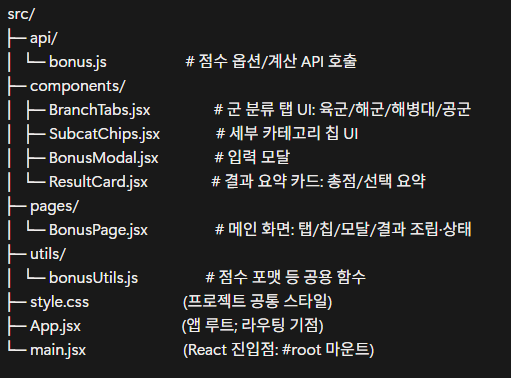

# 프로젝트 소개

병무청 공공 API를 활용하여 현재 모집중인 병과 조회 서비스 및 합격률 계산 서비스 제공

- 합격률 계산 서비스는 구현 예정

## 실행 방법

- 전제조건: [Node.js](https://nodejs.org/ko/) 설치가 되어 있어야 함

터미널 열기 (VSCode: Ctrl+J)
의존성 라이브러리 설치

```Bash
npm install
```

개발 서버 실행

```Bash
npm run dev
```

터미널에 표시된 [웹사이트](http://localhost:xxxx) 접속하여 확인

## 폴더 구조



## 현재 데이터 흐름 (Front-end Only)

참고: 아래 흐름은 현재 프론트엔드 단독으로 동작하는 방식이며, 향후 백엔드 서버가 구축되면 변경될 예정

페이지 진입: 사용자가 메인 페이지(ListPage)에 접속

API 데이터 요청: api.js가 Vite 프록시를 통해 병무청 API 서버에 데이터를 요청

상태 저장: "모집중"인 데이터만 필터링하여 originalItems(원본)와 filteredItems(화면 표시용) 상태에 저장

화면 렌더링: filteredItems의 데이터를 기반으로 각 공고를 카드 형태로 화면에 표시함

## ⚠️ 중요 / 향후 계획

### 데이터 파이프라인 변경

현재는 프록시를 통해 API 데이터를 직접 받고 있지만, 추후 백엔드 서버를 구축하여 DB에 데이터를 저장/가공한 뒤 JSON 형식으로 클라이언트에 전달하는 방식으로 변경할 예정임
